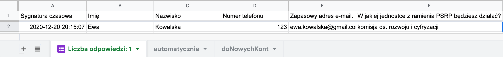
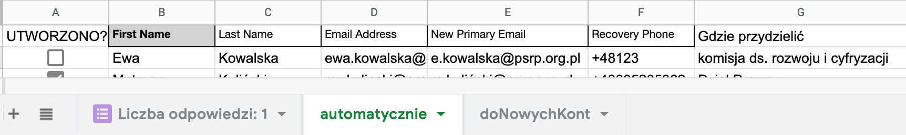
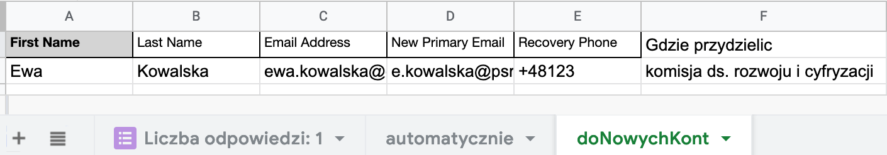

# Jak dodać wielu użytkowników do organizacji GSuite przy pomocy Google App Scripts

## Motywacja

Jako admin GSuite znudziło mi manualne dodawnie kont do GSuite, dlatego razem z Komisją ds. rozwoju i cyfryzacji PSRP stworzyliśmy kod, który robi to za mnie 😊.

### Co robi?

- pobiera dane z Arkuszy Google
- przygotuje treść powitalną dla nowego użytkownika
- dodaje nowego użytkownika oraz dodaje go do grupy
- wysyła podsumowanie do właściciela grupy

### Wymagania

1. Odpowiedno przygotowany formularz rejestracyjny do domeny posiadający pola:

- Imię
- Nazwisko
- Zapasowy adres email
- Zapasowy numer telefonu
- Lista wyboru komisji grupy, do której osoba ma zostać przypisana (w naszym przypadku każda dodawana do GSuite osoba również przynależy do konkretnej grupy)

2. Zapisywanie odpowiedzi z formularza do arkusza Google Sheets

3. Przygotowanie arkusza, do którego będą odpowiednio kopiowane dane:

Dane z formularza


Kopia danych z formularza


##### Odpowiednio:

- Utworzono -> przypomnienie czy dla danego wiersza utworzono wcześniej konto
- **Imię, nazwisko, Email Address, Recovery Phone, Gdzie przydzielić** -> formuła pobierająca dane z arkusza 'Liczba odpowiedzi'
- New Primary Email -> formuła formująca nowy adres email, dla PSRP:
  `=ZŁĄCZ.TEKSTY(LITERY.MAŁE(LEWY(B2));".";LITERY.MAŁE(C2);"@psrp.org.pl")`

Wynikiem jest i.nazwisko@psrp.org.pl z polskimi znakami (z nimi radzimy sobie później)

Arkusz, do którego kopiuje się wiersze z 'automatycznie' do tej pory nieprzetworzone.


### Połączenie arkusza z Google App Scripts.

W tym momencie się zaczyna najciekawsza część. Należy wejść na stronę: https://script.google.com, następnie utworzyć nowy projekt.

Uruchomienie integracji Google Sheets + Google Admin + Google App Scripts jest wymagane do poprawnego działania. O konkretne pozwolenia zostaniemy poproszeni w momencie 1. uruchomienia skryptu.

Kod skryptu składa się z dwóch plików:

- AddMulitpleUsers.gs -> główna funckja skryptu
- helpers.gs -> zbiór funkcji i stałych wykorzystywanych w skrypcie

plik: AddMultipleUsers

```javascript
const googleSheetUrlToken = "xyz"; // ID arkusza kalkulacyjnego (wyciągnięta z jego URL)
const sheetName = "doNowychKont"; //nazwa karty arkusza

function addUser() {
  let ss = SpreadsheetApp.openById(googleSheetUrlToken);
  const sheet = ss.getSheetByName(sheetName);
  let newUsersSheetData = sheet.getDataRange().getValues().slice(1); // dane z danego arkusza bez nagłówka

  const newUsersPerGroup = generateNewEmailsDict(fixedGroupOwners);

  for (let i = 0; i < newUsersSheetData.length; i++) {
    // dla każdego wiersza z odczytywanego arkusza
    const {
      name,
      lastName,
      recoveryEmail,
      recoveryPhone,
      userDomainEmail,
      newPassword,
    } = extractUserDetails(newUsersSheetData[i]);
    const newUser = getUserObject(
      userDomainEmail,
      name,
      lastName,
      recoveryEmail,
      recoveryPhone,
      newPassword
    );

    try {
      // wybranie adresu email grupy na podstawie wyboru użykownika
      const usersGroupEmail =
        matchChoosenTargetGroupToGroupEmail[newUsersSheetData[i][6]];
      try {
        // tutaj będziemy poproszeni o pozwolenie na korzystanie z Admin API -> klikamy tak
        const addedUser = AdminDirectory.Users.insert(newUser);
      } catch (e) {
        Logger.log(
          "Użytkownik o takim adresie email prawdopodobnie już istnieje"
        );
        Logger.log(e);
      }
      const groupMember = getMemberOfGroupDetails(newUser.primaryEmail);

      try {
        const member = AdminDirectory.Members.insert(
          groupMember,
          usersGroupEmail
        );
      } catch (e) {
        Logger.log(e);
      }

      const messageForUser =
        getWelcomeMessage(
          name,
          newUser.primaryEmail,
          newPassword,
          usersGroupEmail
        ) + itGroupEmailFooter;
      // dodanie użytkownika do listy stworzonych członków dla konkretnej grupy google
      newUsersPerGroup[usersGroupEmail].push(
        `${recoveryEmail} | ${newUser.primaryEmail}`
      );
      // kolejne pozwolenie
      GmailApp.sendEmail(recoveryEmail, NEW_USER_WELCOME_MESSAGE_SUBJECT, "", {
        bcc: "",
        htmlBody: messageForUser,
        from: "it@psrp.org.pl",
      });
    } catch (e) {
      Logger.log(e);
    }
  }
  // dla każdego maila komisyjnego wyślij podsumowanie na adres jej właściciela
  for (const [key, value] of Object.entries(newUsersPerGroup)) {
    if (value.length !== 0) {
      const ownerMessage =
        getReminderForGroupOwner(key, value) + itGroupEmailFooter;
      GmailApp.sendEmail(
        fixedGroupOwners[key],
        NOTIFY_OWNER_MESSAGE_SUBJECT,
        "",
        { bcc: "", htmlBody: ownerMessage, from: "it@psrp.org.pl" }
      );
    }
  }
}
```

plik: helpers

```javascript
// wygenerowanie treści wiadomości powitalnej dla użytkownika - wysłana na jego mail zapasowy
const getWelcomeMessage = (
  newUsersName,
  newEmail,
  newUsersPassword,
  groupMail
) => `
<div style="color: #3c4043; background-color: #fffffe; font-family: 'Roboto Mono', Menlo, Monaco, 'Courier New', monospace; font-weight: 400; font-size: 13px; line-height: 20px; white-space: pre;">
<div>Cześć ${newUsersName}!</div>
<br />
<div>Zostało utworzone dla Ciebie konto w domenie @psrp.</div>
<br />
<div>Dane potrzebne do zalogowania:</div>
<div>1) e-mail: ${newEmail}</div>
<div>2) hasło: ${newUsersPassword}</div>
<div>3) link: https://accounts.google.com/signin/v2/identifier?hl=PL&amp;flowName=GlifWebSignIn&amp;flowEntry=ServiceLogin</div>
<br />
<div>W ciągu 48h zaloguj się na nie i koniecznie zmień jego hasło! Po zalogowaniu otrzymasz o to prośbę.</div>
<div>&nbsp;</div>
<div>Ogłaszamy, że zostałeś dodany do grupy wybranej w formularzu zgłoszeniowym. Jej adres to: ${groupMail}.</div>
<br />
<div>W razie jakichkolwiek problem&oacute;w proszę kontaktować się&nbsp;z it@psrp.org.pl.</div>
</div>
`;

const getOrderedNewUsersList = (newUsers) => {
  let newList = ["<p>&nbsp;</p>"];
  newList.push(`<ol>`);
  newUsers.forEach((email) => {
    newList.push(`<li>${email}</li>`);
  });
  newList.push(["</ol>"]);
  newList.push("<p>&nbsp;</p>");
  return newList.join("\n");
};

// wygenerowanie treści wiadomości email dla właścicieli grup
const getReminderForGroupOwner = (groupMail, newUsers) => `
<div style="color: #3c4043; background-color: #fffffe; font-family: 'Roboto Mono', Menlo, Monaco, 'Courier New', monospace; font-weight: 400; font-size: 13px; line-height: 20px; white-space: pre;">
<div>Cześć!</div>
<div>&nbsp;</div>
<div>Na wniosek złożony w formularzu rejestracyjnym kont psrp, do Twojej grupy ${groupMail} została dodana nowa osoba/y: ${getOrderedNewUsersList(
  newUsers
)}</div>
<div>&nbsp;</div>
<div>Przypomnij jej, aby sprawdziła maila wyznaczonego w formularzu jako zapasowy.</div>
<div>&nbsp;</div>
<div>Pozdrowienia z piwnicy!</div>
<div>&nbsp;</div>
<div>&nbsp;</div>
</div>
`;

const itGroupEmailFooter = `
<div>KOD HTML STOPKI NADAWCY</div>
`;
// funckja zwracająca adres e-mail grupy na podstawie opcji zaznaczonej w formularzu rejestracyjnym.
// Gdy nie znajdzie odpowiednika z formularza, zwróci undefined i popsuje przebieg skrypu
const matchChoosenTargetGroupToGroupEmail = {
  "komisja ds. rozwoju i cyfryzacji": "rozwoj@psrp.org.pl",
};

// funckja zwracająca adres e-mail właściciela grupy - kto ma zostać powiadomionym o otwarciu nowego konta w grupie
const fixedGroupOwners = {
  "rozwoj@psrp.org.pl": "m.majchrowski@psrp.org.pl",
};

// funkcja zwracająca obiekt do agregowania nowych kont użytkownika, aby grupowo wysłać użytkowników do właściciela grupy
const generateNewEmailsDict = (groupOwners) => {
  const groupEmails = {};

  Object.keys(groupOwners).forEach((groupEmail) => {
    groupEmails[groupEmail] = [];
  });

  return groupEmails;
};

const polishSignsMapper = {
  ą: "a",
  ę: "e",
  ó: "o",
  ś: "s",
  ł: "l",
  ż: "z",
  ź: "z",
  ć: "c",
  ń: "n",
};

// usunięcie z adresu email z domeny psrp polskich znaków oraz spacji
const removePolishSigns = (email) => {
  let preparedEmail = email;
  preparedEmail = preparedEmail.replace(" ", "");
  preparedEmail = preparedEmail.replace(/[^A-Za-z0-9\[\] ]/g, (letter) => {
    return polishSignsMapper[letter] || letter;
  });
  return preparedEmail;
};

const getUserObject = (
  userDomainEmail,
  name,
  lastName,
  usersRecoveryEmail,
  usersRecoveryPhone,
  newPassword
) => {
  return {
    primaryEmail: userDomainEmail,
    name: {
      givenName: name,
      familyName: lastName,
    },
    recoveryEmail: usersRecoveryEmail,
    recoveryPhone: usersRecoveryPhone,
    password: newPassword,
    orgUnitPath: "/",
    changePasswordAtNextLogin: true,
  };
};

// wyciągniecie z wiersza arkusza informacji o użytkowniku
const extractUserDetails = (dataRow) => {
  return {
    name: dataRow[0],
    lastName: dataRow[1],
    recoveryEmail: dataRow[2],
    recoveryPhone: dataRow[4],
    userDomainEmail: removePolishSigns(dataRow[3]),
    newPassword: Math.random().toString(36),
  };
};

// opcje wymagane przy dodawaniu użytkownika do grupy google'owskiej
const getMemberOfGroupDetails = (newUserEmail) => {
  return {
    email: newUserEmail,
    role: "MEMBER", // uprawnienia członka
  };
};
```
